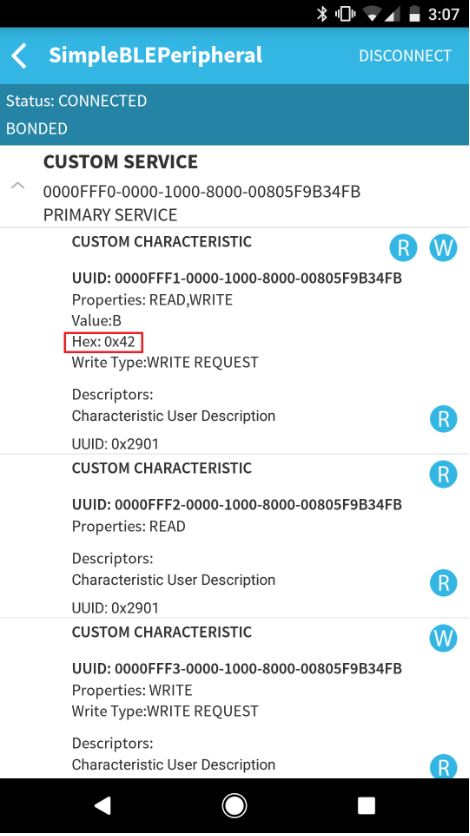

# Simple Peripheral

My motivation while creating this repo is to create a Linux environment for TI CC2640R2 launchpad to build and debug the firmware through console.

This is a nice example with the following features;

1. BLE5 peripheral (removed bonding feature)
2. I2C usage with MPU6050 sensor
3. SPI usage with MX25R8035F flash
4. GPIO (button interrupt and led output) usage
5. TI RTOS task usage
6. GDB usage

## IO Layout

## Introduction

The simple_peripheral project implements a simple Bluetooth low energy peripheral device with GATT services
and demonstrates the TI Simple Prole. This project can be a framework for developing many dierent
peripheral-role applications. The Simple Peripheral project is used as the baseline for explaining the stack in
the **BLE5-Stack User's Guide**.

This project uses stack and app congurations that are summarized in the table below:

FlashROM_Library congurations use the stack library conguration, which is explained **here**.

This document discusses the procedure for using the Simple Peripheral application when the
FlashROM_StackLibrary conguration is used, and the FlashROM_StackLibrary_RCOSC conguration is
discussed in the **RCOSC section of the BLE5-Stack User's Guide**.

## Hardware Prerequisites

The default Simple Peripheral conguration uses the LAUNCHXL-CC2640R2. This hardware conguration is
shown in the below image:

For custom hardware, see the **Running the SDK on Custom Boards section of the BLE5-Stack User's Guide**.

## Software Prerequisites

For information on what versions of Code Composer Studio and IAR Embedded Workbench to use, see the
Release Notes located in the docs/ble5stack folder. For information on how to import this project into your
IDE workspace and build/run, please refer to **The CC2640R2F Platform section in the BLE5-Stack User's
Guide**.

## Service/Prol e Table

This project contains 1 service, which has 5 characteristics.

Note that BLE Scanner may report 128 bit UUIDs, but the project is generating 16 bit UUIDs.

## Usage

This application uses the UART peripheral to provide an interface for the application. The UART is only used for
display messages.

This document will use TeraTerm to serve as the display for the output of the CC2640R2 LaunchPad, and it will
use BLE Scanner as the phone app that will act as the central device that will connect to the Simple Peripheral
device. Note that any other serial terminal and smart phone BLE application can be used. The following
default parameters are used for the UART peripheral for display:

Once the Simple Peripheral sample application starts, the output to the terminal will report it's address and
the fact that it is advertising, as shown below:

Advertising is enabled by default upon startup, so there is no need to physically press a button to start
advertising. Using BLE Scanner to scan for the device, you should see a device with the name of
SimplePeripheral (note that the navigation might be slightly dierent depending on your mobile application):

If there is more than 1 device called SimplePeripheral, the RSSI value in the colored circles on the left can be
used to nd which device you are trying to connect to. Press the "connect" button to connect to the device.
Once connected, the terminal window will show the address of the connected device (smartphone):

After a connection is formed, you will also have the option to switch which physical layer (PHY) preference is
used. For more information on the dierences between the PHY options, see **LE 2M PHY section of the BLE5-
Stack User's Guide**.

In BLE Scanner, you should be able to see various information about the Simple Peripheral device:

You should see 1 service, which is labeled as "CUSTOM SERVICE" (this may be slightly dierent for other
smartphone applications). It will also provide its UUID. Clicking on this service will display the 5 characteristics
that it contains, with information about each characteristic:

Scrolling down should show all 5 characteristics. The following sections detail the functions and operations of
each of the characteristics.

### Characteristic 1 (UUID: FFF1)

This characteristic demonstrates both read and write properties, and it contains a 1-byte-long value. As shown
below, there are 2 circles, one with an "R" and one with a "W", next to "CUSTOM CHARACTERISTIC":

These are the buttons used for read and write operations. The value for this characteristic is set to "01" by
default, and it can be changed by pressing the write button. Upon pressing the write button, you will see the
following menu:

To write a new byte value to it, click on "Text" to change it to "Byte Array", and then enter the value that you
want to write to the characteristic (in hexadecimal) in the eld below. Press ok, and then you will be able to see
that the value has changed by looking at the terminal window. The example below shows a write of 0x42:

Note that the terminal window will print the value in decimal. The value will also be updated in BLE Scanner:

The read button can be used to read a value. If the Simple Peripheral device has changed the value of the
characteristic (i.e. by using a button press), then pressing the read button will show the updated value in BLE
scanner as shown above.

There is also a circle with an "R" next to "Characteristic User Description". Pressing this will show the name of
the characteristic, as shown below:

### Characteristic 2 (UUID: FFF2)

This characteristic has read property only. Its value can be read following the same procedure as is detailed for
characteristic 1. It has a default value of 0x02.

### Characteristic 3 (UUID: FFF3)

This characteristic has write property only. Its value can be written to following the same procedure as is
detailed for characteristic 1. It has a default value of 0x03.

### Characteristic 4 (UUID: FFF4)

This characteristic has notify property only. It is a single byte, and it is set to whatever value is contained in
characteristic 3 (this value can be changed by writing to characteristic 3). Next to "CUSTOM CHARACTERISTIC"
there is a circle with an "N". Pressing this button will enable notications, and this characteristic will be
updated and will display the value contained in characteristic 3:

Before pressing the notify button, the read button next to "Client Characteristic Conguration" can be pressed
to show whether notications (or indications) have been enabled:

Once notications have been enabled, this will be displayed:

### Characteristic 5 (UUID: FFF5)

This characteristic has read property only. It is 5 bytes, and its default value is 0x0102030405. It diers from
the other characteristics in that it requires authentication. This is done by pairing the smartphone with the
Simple Peripheral device. The process of doing this varies depending on the smartphone application and the
operating system that is being used. Please see documentation on the operating system that you are using for
more details. Some documentation for iOS can be found **here** , and some for android can be found **here**. If the
Simple Peripheral device and the smartphone have not been paired, you will not see anything when you press
the read button (this includes reading the characteristic user description). Once the devices are paired,
pressing the read button will show the characteristic's value as shown below:

## Production Test Mode (PTM)

PTM mode allows a BLE application in a "single-chip" conguration to temporarily expose the host control
interface (HCI) test commands over the serial interface when triggered externally to do so (e.g. holding a GPIO
pin low during power up). This test mode allows the device to be connected to a Bluetooth RF Tester in order
to run Direct Test Mode (DTM) commands on a production line using the nal release rmware.

A possible use of PTM mode is showcased in this Simple Peripheral project and can be enabled with a change
in project conguration or by adding a preprocessor dene of PTM_MODE to the application *.opt le.

### Enabling PTM Mode on the Simple Peripheral Application

In order to enter PTM mode

1) Change your project conguration to FlashROM_StackLibrary_PTM

2) Rebuild the stack project

3) Rebuild the app project

4) Flash the app project (Up to this point all we did was add the option to enter PTM mode via the 2-button
menu)

5) Click on the right button on the LaunchPad to start PTM operation

Now, on boot when connected to a UART terminal you will see the option enable PTM mode.

Note: Once transitioned to PTM mode, the UART feed will stop and it's responsibility will transfer to the NPI
task to handle the receiving and transmitting of test mode commands. In order to exit this mode, a reboot is
required.

# NOTES

PS: Bootloader related things can be found in the links and the examples (they are calling bootloader as "bim")

PS: Windows Desktop application written in C# can be found in the "tools"

1. [BLE5-Stack User’s Guide](https://software-dl.ti.com/lprf/simplelink_cc26x2_latest/docs/ble5stack/ble_user_guide/html/ble-stack-5.x-guide/index-cc26x2.html)
2. [More Example](https://github.com/dogusyuksel/ti_cc2640r2f_sdk/tree/master/simplelink_cc2640r2_sdk_5_30_01_11/examples)
3. [Schematic Details](./docs/LAUNCHXL-CC2640R2_1_0_0_Schematics.pdf)
4. [More on BLE on Linux](./docs/Communication_with_Bluetooth_Low-Energy_Devices_on_Linux.pdf)
5. [More on BLE on Linux](https://github.com/IanHarvey/bluepy)
6. [More](./docs)

